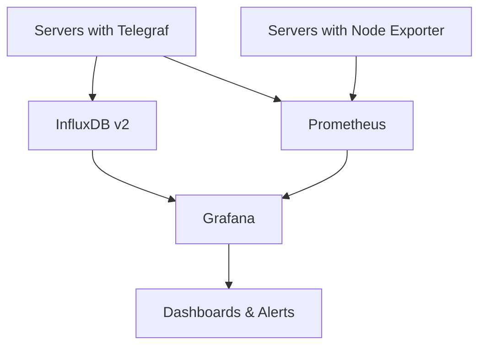

# 📊 Ansible Monitoring Stack

Automated deployment of a complete monitoring infrastructure using **Prometheus**, **Grafana**, **Telegraf**, and **Node Exporter** with Ansible.

## 🎯 Project Overview

This Ansible project automates the installation and configuration of a production-ready monitoring stack across your infrastructure. It provides centralized metrics collection, storage, visualization, and alerting capabilities.

**What it deploys:**
- **🔍 Prometheus**: Time-series database and monitoring system
- **📈 Grafana**: Visualization and dashboarding platform  
- **📡 Telegraf**: Metrics collection agent for InfluxDB
- **🖥️ Node Exporter**: System metrics exporter for Prometheus
- **⚠️ Alerting**: Basic alert rules and configurations

## 🏗️ Architecture



The architecture follows a hub-and-spoke model where:
- **Agents** (Telegraf, Node Exporter) run on application servers
- **Prometheus** centrally scrapes metrics from all agents
- **Grafana** provides unified dashboards and alerting
- **InfluxDB** stores additional metrics from Telegraf

## 📁 Project Structure

```
ansible-monitoring/
├── ansible.cfg                 # Ansible configuration
├── site.yml                   # Main playbook
├── requirements.yml            # Collection dependencies
├── inventory/                  # Host inventories
├── group_vars/                 # Group variables
├── roles/                      # Ansible roles
│   ├── common/                # Common system setup
│   ├── prometheus/            # Prometheus server
│   ├── grafana/               # Grafana server
│   ├── telegraf/              # Telegraf agent
│   └── node_exporter/         # Node Exporter agent
├── tests/                     # Testing infrastructure
└── scripts/                   # Utility scripts
```

## 🚀 Quick Start

### Prerequisites

- **Ansible** >= 2.9
- **Python** >= 3.6
- **SSH access** to target servers
- **sudo privileges** on target servers

### Basic Deployment

1. **Configure your inventory** in `inventory/hosts.ini`:
   ```ini
   [monitoring]
   monitoring.example.com

   [application_servers]
   web1.example.com
   web2.example.com
   api.example.com

   [telegraf_servers:children]
   application_servers

   [exporter_servers:children]
   application_servers
   monitoring

   [prometheus:children]
   monitoring

   [grafana:children]
   monitoring
   ```

2. **Set your variables** in `group_vars/all.yml`:
   ```yaml
   # Software versions
   prometheus_version: "2.45.0"
   node_exporter_version: "1.5.0"
   
   # Network configuration
   prometheus_port: 9090
   grafana_port: 3000
   
   # Data retention
   prometheus_retention: "30d"
   ```

3. **Deploy the stack**:
   ```bash
   ansible-playbook site.yml
   ```

4. **Access your services**:
   - Prometheus: `http://monitoring.example.com:9090`
   - Grafana: `http://monitoring.example.com:3000`

## 🎛️ Configuration Options

### Inventory Patterns

**Small Infrastructure (3-10 servers)**
- Single monitoring server running all services
- All application servers with both Telegraf and Node Exporter

**Medium Infrastructure (10-50 servers)**
- Separate servers for Prometheus, Grafana, and InfluxDB
- Application servers grouped by function (web, api, database)

**Large Infrastructure (50+ servers)**
- Multiple Prometheus instances (by region/environment)
- Centralized Grafana with federation
- Distributed InfluxDB instances

### Key Variables

Located in `group_vars/all.yml`:

```yaml
# Versions (centrally managed)
prometheus_version: "2.45.0"
node_exporter_version: "1.5.0"
telegraf_version: "1.25.0"

# Network & Security
configure_firewall: true
prometheus_port: 9090
grafana_port: 3000

# Data Management
prometheus_retention: "30d"
backup_enabled: true
backup_retention_days: 7

# System Configuration
timezone: "UTC"
prometheus_user: "prometheus"
```

### Secrets Management

Use Ansible Vault for sensitive data in `group_vars/vault.yml`:

```bash
# Create encrypted file
ansible-vault create group_vars/vault.yml

# Edit encrypted file
ansible-vault edit group_vars/vault.yml

# Deploy with vault
ansible-playbook site.yml --ask-vault-pass
```

## 🧪 Testing

The project includes comprehensive testing options for different scenarios.

### Option 1: Docker Compose (Fastest)

Ideal for quick validation and development:

```bash
# Start test environment
docker-compose -f tests/docker-compose.test.yml up -d

# Run playbook against containers
ansible-playbook site.yml -i inventory/docker.ini

# Verify services
curl http://localhost:9090  # Prometheus
curl http://localhost:3000  # Grafana

# Cleanup
docker-compose -f tests/docker-compose.test.yml down
```

### Option 2: Vagrant (Most Realistic)

Best for testing system-level configurations:

```bash
# Navigate to tests directory
cd tests/

# Create VMs
vagrant up

# Run playbook
ansible-playbook site.yml -i inventory/vagrant.ini

# SSH into VMs
vagrant ssh monitoring
vagrant ssh web1

# Cleanup
vagrant destroy -f
```

### Option 3: Molecule (Professional)

Complete testing framework with automated verification:

```bash
# Install dependencies
pip install molecule[docker] pytest testinfra

# Run full test suite
molecule test

# Individual test phases
molecule create    # Create test infrastructure
molecule converge  # Run playbook
molecule verify    # Run test assertions
molecule destroy   # Cleanup
```

### Automated Testing

The project includes automated tests that verify:
- ✅ Services are running and enabled
- ✅ Ports are listening correctly
- ✅ Configuration files are deployed
- ✅ Users and permissions are set
- ✅ Metrics endpoints are accessible
- ✅ Inter-service connectivity works

## 📊 Monitoring Capabilities

### Metrics Collected

**System Metrics (Node Exporter)**:
- CPU usage per core and total
- Memory utilization and availability
- Disk space and I/O statistics
- Network traffic and errors
- System load averages

**Application Metrics (Telegraf)**:
- Process monitoring
- Service-specific metrics
- Custom application metrics
- Log parsing and analysis

### Built-in Alerts

Pre-configured alert rules include:
- **High CPU Usage**: >80% for 5 minutes
- **High Memory Usage**: >85% for 5 minutes
- **Low Disk Space**: <10% available for 5 minutes
- **Service Down**: Prometheus target unreachable
- **High Load Average**: >2.0 for 5 minutes

### Dashboards

Grafana comes pre-configured with:
- System overview dashboard
- Node Exporter metrics visualization
- Prometheus target health
- Alert status and history

## 🔧 Operational Commands

### Deployment Commands

```bash
# Full deployment
ansible-playbook site.yml

# Deploy specific components
ansible-playbook site.yml --tags prometheus
ansible-playbook site.yml --tags grafana
ansible-playbook site.yml --limit monitoring

# Dry run (no changes)
ansible-playbook site.yml --check --diff

# Verbose output
ansible-playbook site.yml -vvv
```

### Verification Commands

```bash
# Check syntax
ansible-playbook --syntax-check site.yml

# Lint playbook
ansible-lint site.yml

# Verify connectivity
ansible all -m ping

# Check service status
ansible all -m systemd -a "name=prometheus"
ansible all -m systemd -a "name=node_exporter"
```

### Maintenance Commands

```bash
# Restart services
ansible prometheus -m systemd -a "name=prometheus state=restarted"

# Update configuration
ansible-playbook site.yml --tags config

# Check logs
ansible all -m shell -a "journalctl -u prometheus -n 20"
```

## 🔒 Security Considerations

### Network Security

- Prometheus (9090): Internal network only
- Grafana (3000): VPN or authenticated access
- Node Exporter (9100): Prometheus access only
- Telegraf (8125): Metrics endpoint secured

### System Security

- Dedicated system users for each service
- Minimal file permissions
- SELinux/AppArmor compatibility
- Firewall rules automatically configured

### Best Practices

- ✅ Use Ansible Vault for secrets
- ✅ Implement network segmentation
- ✅ Regular security updates
- ✅ Monitor the monitoring infrastructure
- ✅ Backup configurations and data

## 🚨 Troubleshooting

### Common Issues

**SSH Connection Problems**:
```bash
# Test connectivity
ansible all -m ping
# Copy SSH keys
ssh-copy-id user@server
```

**Service Start Failures**:
```bash
# Check service status
ansible all -m shell -a "systemctl status prometheus"
# View logs
ansible all -m shell -a "journalctl -u prometheus -n 50"
```

**Port Conflicts**:
```bash
# Check port usage
ansible all -m shell -a "netstat -tlnp | grep :9090"
# Modify port in group_vars/all.yml
```

**Permission Issues**:
```bash
# Check file ownership
ansible all -m shell -a "ls -la /etc/prometheus/"
# Fix permissions
ansible-playbook site.yml --tags permissions
```

### Log Locations

- **Prometheus**: `/var/log/prometheus/` or `journalctl -u prometheus`
- **Grafana**: `/var/log/grafana/` or `journalctl -u grafana-server`
- **Node Exporter**: `journalctl -u node_exporter`
- **Telegraf**: `journalctl -u telegraf`

## 🔄 Updates and Maintenance

### Version Updates

1. Update version variables in `group_vars/all.yml`
2. Run playbook with updated configuration
3. Verify services after update

### Backup Strategy

- Configuration files backed up before changes
- Prometheus data retention configurable
- Grafana dashboards exported automatically
- Database backups scheduled if enabled

### Monitoring the Monitors

- Prometheus monitors itself
- Grafana health checks included
- Node Exporter metrics for monitoring servers
- Alert if monitoring infrastructure fails

## 🤝 Contributing

1. Fork the repository
2. Create a feature branch
3. Add tests for new functionality
4. Ensure all tests pass
5. Submit a pull request

### Development Guidelines

- Follow Ansible best practices
- Use `ansible-lint` for code quality
- Add documentation for new variables
- Include tests for new roles
- Update README for significant changes

## 📄 License

This project is licensed under the MIT License - see the LICENSE file for details.

## 🆘 Support

- **Issues**: Report bugs and request features via GitHub Issues
- **Documentation**: Additional documentation in the project wiki
- **Community**: Join discussions in GitHub Discussions

---

**⭐ If you find this project useful, please give it a star on GitHub!**