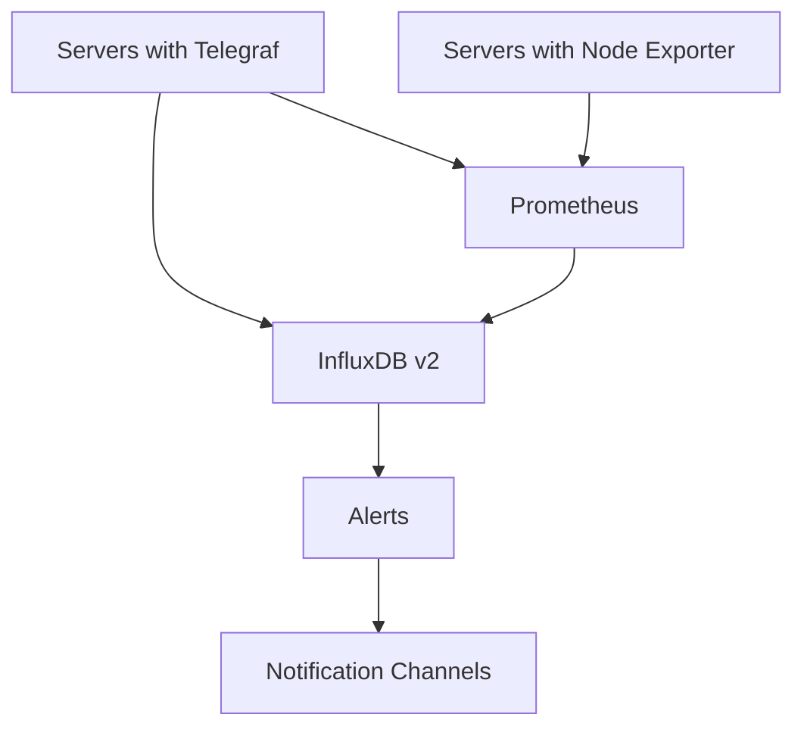

# 📊 Ansible Monitoring Stack

Automated deployment of a complete monitoring infrastructure using **Prometheus**, **InfluxDB**, **Telegraf**, and **Node Exporter** with Ansible.

## 🎯 Project Overview

This Ansible project automates the installation and configuration of a production-ready monitoring stack across your infrastructure. It provides centralized metrics collection, storage, visualization, and alerting capabilities.

**What it deploys:**

* **🔍 Prometheus**: Time-series database and monitoring system
* **📦 InfluxDB**: Time-series database optimized for high-write workloads
* **📡 Telegraf**: Metrics collection agent for InfluxDB
* **🖥️ Node Exporter**: System metrics exporter for Prometheus
* **⚠️ Alerting**: Basic alert rules and configurations

## 🏗️ Architecture



## 📁 Project Structure

```
ansible-monitoring/
├── ansible.cfg                 # Ansible configuration
├── site.yml                    # Main playbook
├── Vagrantfile                 # Vagrant + Docker provider environment
├── inventory/                  # Host inventories
│   ├── hosts.ini               # Production inventory
│   └── vagrant.ini             # Vagrant test inventory
├── group_vars/                 # Group variables
├── roles/                      # Ansible roles
│   ├── common/                 # Common system setup
│   ├── prometheus/             # Prometheus server role
│   ├── telegraf/               # Telegraf agent role
│   └── node_exporter/          # Node Exporter agent role
├── tests/                      # Testing infrastructure (Compose, Molecule, etc.)
└── scripts/                    # Utility scripts
```

## 🚀 Quick Start

### Prerequisites

* **Ansible** >= 2.9
* **Python** >= 3.6 on control node and targets
* **SSH access** to target servers
* **sudo** privileges on target servers
* **(Optional)** Docker & Vagrant for local testing

---

### 1️⃣ Production Deployment

1. **Configure your inventory** in `inventory/hosts.ini`:

   ```ini
   [monitoring]
   prometheus.example.com

   [application_servers]
   web1.example.com
   web2.example.com
   api.example.com

   [telegraf_servers:children]
   application_servers

   [node_exporter_servers:children]
   application_servers
   monitoring

   [prometheus:children]
   monitoring

   [influxdb:children]
   monitoring

   [alerting]
   monitoring

   [all:vars]
   ansible_python_interpreter=/usr/bin/python3
   ```

2. **Set your variables** in `group_vars/all.yml`:

   ```yaml
   # Versions
   prometheus_version: "2.45.0"
   influxdb_version: "2.6.1"
   telegraf_version: "1.25.0"
   node_exporter_version: "1.5.0"

   # Ports
   prometheus_port: 9090
   influxdb_port: 8086

   # Data retention
   prometheus_retention: "30d"
   ```

3. **Run the playbook**:

   ```bash
   ansible-playbook site.yml -i inventory/hosts.ini
   ```

4. **Access services**: **Run the playbook**:

   ```bash
   ansible-playbook site.yml -i inventory/hosts.ini
   ```

5. **Access services**:

   * Prometheus: `http://prometheus.example.com:9090`
   * InfluxDB:  `http://monitoring.example.com:8086`

---

### 2️⃣ Local Testing with Vagrant + Docker

Use this method to spin up Ubuntu containers locally and test your roles without external servers.

1. **Install prerequisites**:

   * Docker (Engine + CLI)
   * Vagrant (>= 2.2)

2. **(Optional) Create a Docker network** with a non-overlapping subnet (if you need fixed IPs):

   ```bash
   docker network create --subnet=172.30.1.0/24 vagrantnet
   ```

3. **Ensure the provided `Vagrantfile` is in your project root** (it auto-generates an ed25519 key).

4. **Start the Vagrant environment**:

   ```bash
   vagrant destroy -f                # Cleanup previous runs
   vagrant up --provider=docker       # Launch 4 Ubuntu containers with SSH
   ```

5. **Generate SSH config** for Ansible:

   ```bash
   vagrant ssh-config web01 web02 db01 monitor01 > ./.vagrant/ssh-config
   ```

6. **Create the Vagrant inventory** in `inventory/vagrant.ini`:

   ```ini
   [telegraf_servers]
   web01 ansible_host=127.0.0.1 ansible_port=2222
   web02 ansible_host=127.0.0.1 ansible_port=2223
   db01  ansible_host=127.0.0.1 ansible_port=2224

   [node_exporter_servers]
   web01     ansible_host=127.0.0.1 ansible_port=2222
   web02     ansible_host=127.0.0.1 ansible_port=2223
   db01      ansible_host=127.0.0.1 ansible_port=2224
   monitor01 ansible_host=127.0.0.1 ansible_port=2225

   [prometheus]
   monitor01 ansible_host=127.0.0.1 ansible_port=2225

   [influxdb]
   monitor01 ansible_host=127.0.0.1 ansible_port=2225

   [all:vars]
   ansible_user=vagrant
   ansible_ssh_private_key_file=./.vagrant_ed25519
   ansible_python_interpreter=/usr/bin/python3
   ansible_ssh_common_args=-o StrictHostKeyChecking=no -o UserKnownHostsFile=/dev/null
   ```

7. **Test connectivity**:0.0.1 ansible\_port=2222
   web02 ansible\_host=127.0.0.1 ansible\_port=2223

   \[node\_exporter\_servers]
   web01     ansible\_host=127.0.0.1 ansible\_port=2222
   web02     ansible\_host=127.0.0.1 ansible\_port=2223
   db01      ansible\_host=127.0.0.1 ansible\_port=2224
   monitor01 ansible\_host=127.0.0.1 ansible\_port=2225

   \[prometheus]
   monitor01 ansible\_host=127.0.0.1 ansible\_port=2225

   \[influxdb]
   monitor01 ansible\_host=127.0.0.1 ansible\_port=2225

   \[alerting]
   monitor01 ansible\_host=127.0.0.1 ansible\_port=2225

   \[all\:vars]
   ansible\_user=vagrant
   ansible\_ssh\_private\_key\_file=.vagrant\_ed25519
   ansible\_python\_interpreter=/usr/bin/python3
   ansible\_ssh\_common\_args=-F ./.vagrant/ssh-config

   ```
   ```

8. **Test connectivity**:

   ```bash
   ansible all -i inventory/vagrant.ini -m ping
   ```

9. **Run the playbook** locally:

   ```bash
   ansible-playbook site.yml -i inventory/vagrant.ini
   ```

10. **Cleanup**:

    ```bash
    vagrant destroy -f
    ```

---

## 🎛️ Configuration Options

**Inventory Patterns**

* **Small:** Single monitoring server; all agents on app servers.
* **Medium:** Separate servers for Prometheus, InfluxDB, Grafana; grouped app servers.
* **Large:** Multiple Prometheus instances; federated Grafana; distributed InfluxDB.

### Key Variables (`group_vars/all.yml`)

```yaml
# Versions (LTS/estables)
telegraf_version: "1.28"
prometheus_version: "2.47.0"
node_exporter_version: "1.6.1"
influxdb_version: "1.8.10"

# Ports
prometheus_port: 9090
node_exporter_port: 9100
influxdb_port: 8086
telegraf_port: 8125

# Basic config
cluster_name: "monitoring"
environment: "production"
timezone: "Europe/Madrid"

# InfluxDB
influxdb_database: "telegraf"
influxdb_retention: "30d"

# Users
prometheus_user: "prometheus"
telegraf_user: "telegraf"
influxdb_user: "influxdb"
```

### Secrets Management

Use Ansible Vault for sensitive data:

```bash
ansible-vault create group_vars/vault.yml
ansible-vault edit group_vars/vault.yml
ansible-playbook site.yml --ask-vault-pass
```

## 🧪 Testing

### 1. Docker Compose (Fastest)

```bash
docker-compose -f tests/docker-compose.test.yml up -d
ansible-playbook site.yml -i inventory/docker.ini
curl http://localhost:9090
curl http://localhost:8086
docker-compose -f tests/docker-compose.test.yml down
```

### 2. Vagrant (Realistic)

*(As detailed above in Quick Start)*

### 3. Molecule (Professional)

```bash
pip install molecule[docker] pytest testinfra
molecule test
```

## 📊 Monitoring Capabilities

**System Metrics (Node Exporter)**: CPU, memory, disk, network, load

**Application Metrics (Telegraf)**: process, service, custom, logs

**Alerts**: High CPU, memory, disk, service down, high load

## 🔧 Operational Commands

````bash
ansible-playbook site.yml --check --diff
ansible all -m ping
ansible all -m systemd -a "name=prometheus state=restarted"```

## 🔒 Security

- Use Ansible Vault
- Network segmentation
- Regular updates

## 🚨 Troubleshooting

- **SSH issues**: clean `known_hosts`, use `-F ./.vagrant/ssh-config`
- **Service fails**: `ansible all -m shell -a "journalctl -u prometheus -n 50"`

---

⭐ If you find this project useful, please give it a star on GitHub!

````
