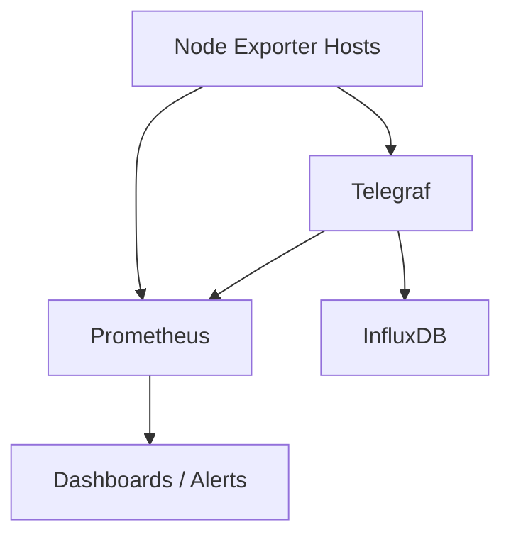

# 📊 Ansible Simple Monitoring Stack

This project provides a **lightweight, minimal monitoring stack** orchestrated with Ansible, consisting of:

* **InfluxDB**: a time-series database for storing metrics collected by Telegraf.
* **Telegraf**: a metrics agent that gathers system and application metrics, sends them to InfluxDB, and exposes a Prometheus-compatible `/metrics` endpoint.
* **Node Exporter**: a Prometheus exporter that provides detailed system metrics.
* **Prometheus**: a monitoring and alerting system that scrapes metrics from Node Exporter and Telegraf.

---

## 🎯 Goal

Provide a reproducible, easy-to-launch environment to validate monitoring configurations before deploying to production. With this setup you can:

* Test Ansible playbooks in a controlled environment.
* Confirm that all services start and communicate as expected.
* Iterate quickly on configurations without needing physical or full virtual machines.

---

## 🔄 Service Interactions



1. **Node Exporter** runs on each server and exposes metrics at `:9100/metrics`.
2. **Telegraf** runs on each server:

   * Collects system metrics.
   * Writes metrics to **InfluxDB** (`:8086/ping`, data writes via UDP/TCP).
   * Exposes a Prometheus endpoint at `:8125/metrics`.
3. **Prometheus** periodically scrapes:

   * The Node Exporter endpoints.
   * The Telegraf Prometheus endpoints.
4. Metrics are stored in **InfluxDB** and **Prometheus** for querying and visualization.

---

## 🛠 Simulating Hosts with Vagrant

To simplify testing, we use **Vagrant** with the **Docker** provider:

1. Each "VM" is actually a Docker container running Ubuntu.
2. Vagrant sets up a private network and maps unique local ports (e.g., 2222, 2223, …).
3. The Ansible inventory points to `127.0.0.1` with different ports to mimic separate hosts.
4. Spin up all containers in parallel with a single command:

   ```bash
   cd ansible-mon-stack
   vagrant up --provider=docker
   ansible-playbook site.yml -i inventory/vagrant.ini
   ```

---

## 🚀 Quick Start

1. **Clone** the repository:

   ```bash
   git clone <repo-url> && cd ansible-mon-stack
   ```
2. **Launch** the test hosts:

   ```bash
   vagrant up --provider=docker
   ```
3. **Run** the Ansible playbook:

   ```bash
   ansible-playbook site.yml -i inventory/vagrant.ini
   ```
4. **Verify** the endpoints:

   ```bash
   curl http://127.0.0.1:2225/-/healthy    # Prometheus
   curl http://127.0.0.1:2225/ping         # InfluxDB
   curl http://127.0.0.1:2222/metrics      # Node Exporter
   curl http://127.0.0.1:2222/metrics      # Telegraf
   ```

---

## 📂 Project Structure

```
ansible-mon-stack/
├─ site.yml
├─ Vagrantfile
├─ inventory/
│  └─ vagrant.ini
├─ group_vars/
│  └─ all.yml
└─ roles/
   ├─ common/
   ├─ influxdb/
   ├─ telegraf/
   ├─ node_exporter/
   └─ prometheus/
```

---

## 🔍 Tips

* Adjust version variables in `group_vars/all.yml`.
* Use `--limit` or `--tags` with `ansible-playbook` to run individual roles.
* For real deployments, remove the Vagrant/Docker layer and point the inventory at your actual servers.

---

Now you have a minimal, fully automated monitoring stack you can spin up and tear down at will. Happy monitoring! 🚀
