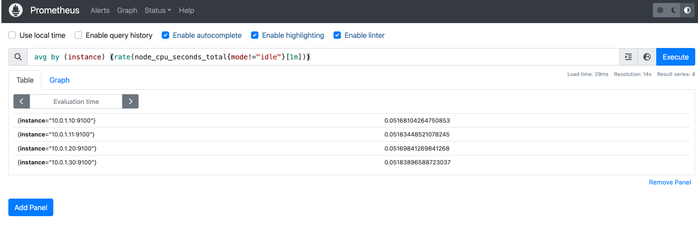

# 📊 Ansible Simple Monitoring Stack

This project provides a **lightweight, minimal monitoring stack** orchestrated with Ansible, consisting of:

* **InfluxDB**: a time-series database for storing metrics collected by Telegraf.
* **Telegraf**: a metrics agent that gathers system and application metrics, sends them to InfluxDB, and exposes a Prometheus-compatible `/metrics` endpoint.
* **Node Exporter**: a Prometheus exporter that provides detailed system metrics.
* **Prometheus**: a monitoring and alerting system that scrapes metrics from Node Exporter and Telegraf.

---

## 🎯 Goal

Provide a reproducible, easy-to-launch environment to validate monitoring configurations before deploying to production. With this setup you can:

* Test Ansible playbooks in a controlled environment.
* Confirm that all services start and communicate as expected.
* Iterate quickly on configurations without needing physical or full virtual machines.

---

## 📂 Project Structure

```
ansible-mon-stack/
├─ site.yml
├─ Vagrantfile
├─ inventory/
│  └─ vagrant.ini
├─ group_vars/
│  └─ all.yml
└─ roles/
   ├─ common/
   ├─ influxdb/
   ├─ telegraf/
   ├─ node_exporter/
   └─ prometheus/
```

---

## 🔄 Service Interactions


1. **Node Exporter** runs on each server and exposes metrics at `:9100/metrics`.
2. **Telegraf** runs on each server:

   * Collects system metrics.
   * Writes metrics to **InfluxDB** (`:8086/ping`, data writes via UDP/TCP).
   * Exposes a Prometheus endpoint at `:8125/metrics`.
3. **Prometheus** periodically scrapes:

   * The Node Exporter endpoints.
   * The Telegraf Prometheus endpoints.
4. Metrics are stored in **InfluxDB** and **Prometheus** for querying and visualization.

---

## 🛠 Simulating Hosts with Vagrant

To simplify testing, we use **Vagrant** with the **Docker** provider:

1. Create the Docker network (one‑time):

   ```bash
   docker network create --driver bridge --subnet 10.0.1.0/24 vagrantnet
   ```
2. Each "VM" is actually an Ubuntu container attached to `vagrantnet` with a static IP (10.0.1.10, .11, .20, .30).
3. Vagrant exposes SSH on localhost ports (2222→web01, 2223→web02, 2224→db01, 2225→monitor01).

---

## 🚀 Quick Start

1. **Clone** the repository:

   ```bash
   git clone <repo-url> && cd ansible-mon-stack
   ```
2. **Ensure** the Docker network exists:
   ```bash
   docker network inspect vagrantnet >/dev/null 2>&1 \
    || docker network create --driver bridge --subnet 10.0.1.0/24 vagrantnet

   ```
3. **Launch** the test hosts:

   ```bash
   vagrant up --provider=docker
   ```
4. **Run** the Ansible playbook:

   ```bash
   ansible-playbook site.yml -i inventory/vagrant.ini
   ```
5. **Verify** the endpoints:

   ```bash
   curl http://10.0.1.10:9100/metrics   # Node Exporter @ web01
   curl http://10.0.1.10:8125/metrics   # Telegraf     @ web01
   curl http://10.0.1.11:9100/metrics   # Node Exporter @ web02
   curl http://10.0.1.11:8125/metrics   # Telegraf     @ web02
   curl http://10.0.1.20:9100/metrics   # Node Exporter @ db01
   curl http://10.0.1.20:8125/metrics   # Telegraf     @ db01
   curl http://10.0.1.30:9100/metrics   # Node Exporter @ monitor01
   ```

---

## 🌐 Accessing the UIs

Once everything is up, you can hit the web UIs directly on your host:
**Prometheus Web UI**

  ```plaintext
  http://localhost:9090
   ```
  ### 📋 Key Sections
  - **Status → Targets**  
    View the list of all scrape targets (Node Exporter, Telegraf endpoints, and Prometheus itself). Each target should show **UP** under the “Status” column.  

    

  - **Graph**  
  Enter PromQL expressions to verify data ingestion. For example:
  ```promql
  avg by (instance) (rate(node_cpu_seconds_total{mode!="idle"}[1m]))
  ```

  

  - **Status → Service Discovery**  
    See how Prometheus discovered each target (e.g., via static_configs). Useful for debugging inventory or template issues.

  - **Status → Rules**
    If you have recording or alerting rules, check their evaluation status here.

  - **Alerts**
    (If configured) view firing or pending alerts.


**InfluxDB HTTP API (Ping)**

  ```plaintext
  http://localhost:8086/ping
   ```
---

## 🔍 Tips

* Adjust version variables in `group_vars/all.yml`.
* Use `--limit` or `--tags` with `ansible-playbook` to run individual roles.
* For real deployments, remove the Vagrant/Docker layer and point the inventory at your actual servers.

---

Now you have a minimal, fully automated monitoring stack you can spin up and tear down at will. Happy monitoring! 🚀
